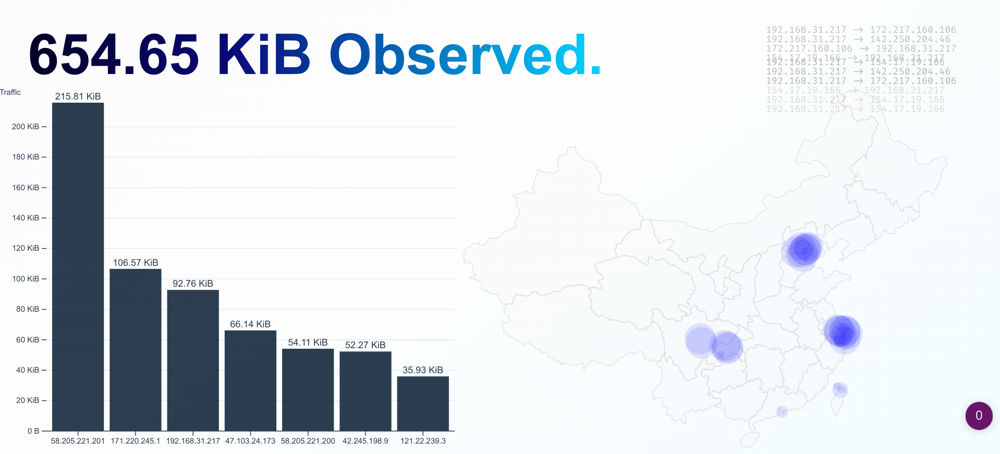

# Simple and Stupid Pcap Visualization

A Simple and Stupid Pcap Visualization application, with some fancy charts.

This project is just a naive attempt to mix pcap, web front-end tech, and d3js together. It intends for nothing serious and definitely comes with no warrant.

## How To Run

1. Build and run `pcap2ws`, which is the backend that captures traffic and pipes the data to the websocket.
2. Build and run `pcap-visual`, which is the web front-end that visualizes the data.

See their READMEs for more information.

## How It Works

The project contains two module: `pcap2ws` and `pcap-visual`.

### pcap2ws

There's no magic that allows you to capture the network traffic from the browser :)

So a native backend is needed to pipe the data into the browser.
`pcap2ws` is a simple and stupid websocket server built upon `websocketpp`. It will broadcast the pcap data at port `9002` by default.

### pcap-visual

A static web page built with `d3js`. It will connect to `localhost:9002` to fetch the pcap data and visualize it.

It draws the traffic in a certain period as a bar chart, as well as points on the map. The map component uses the data of PRC but it should be possible to use others. The format is mostly `geojson`, I guess.

*Disclaimer: The map data of PRC is just dumped from the wild and random Internet. Including the data(as well as borders, regions in it) is mainly for the convenience and does not represent my opinions or positions.*

## Maintenance Status

I don't maintain this.

I will neither respond to any issues nor pull requests. But feel free to use them for discussion or showcase.

## License

I don't care what you're going to do with it.

Hopefully, you can find this project useful in your case, or at least fun :)
